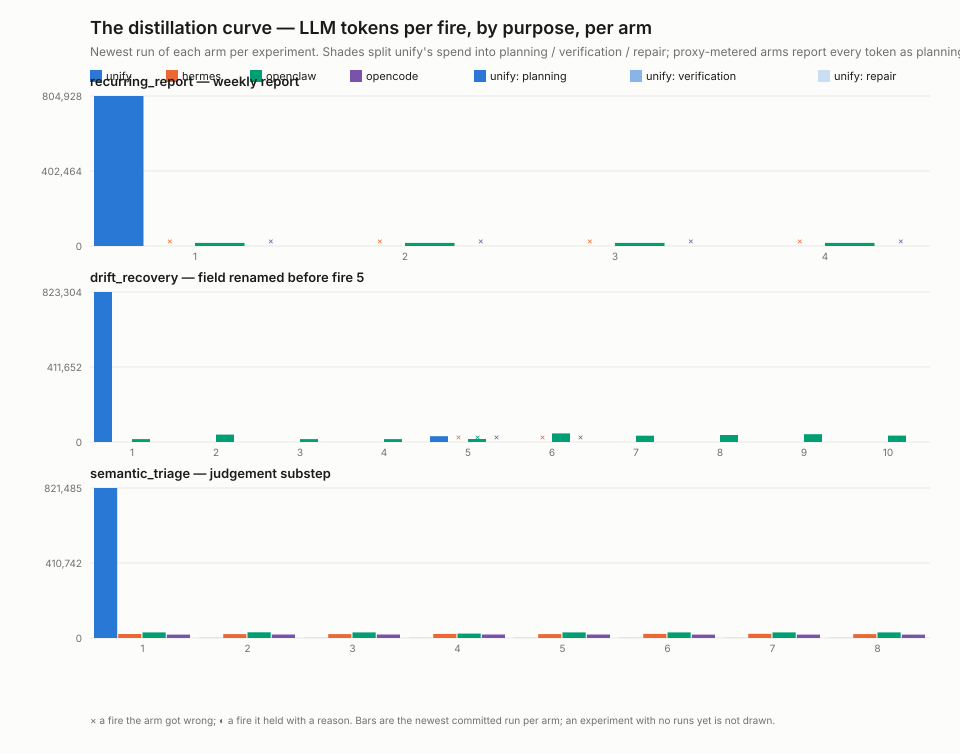

# Colleague

A benchmark for **agent harnesses**, not agent models.

Every arm receives the identical plain-English request, runs unattended, and
is scored against exact recomputed ground truth. The model is pinned and
identical across arms, so what varies is the architecture: what each system
converges to on its own, what that costs, and whether the result still works
next week.

The question the suite is built around is not *can an agent do this once*.
It is *what is it like to have one around* — several people talking to it,
work outliving the conversation, and the world moving underneath.

## Why this exists

Most agent benchmarks hold the harness fixed and vary the model. The few that
vary the harness — [Harness-Bench](https://arxiv.org/abs/2605.27922),
[Claw-SWE-Bench](https://arxiv.org/abs/2606.12344) — measure single-shot task
completion; Harness-Bench's limitations section explicitly excludes long-term
recurring execution and persistent automation. On the other side, the voice
and conversation benchmarks ([τ-Voice](https://arxiv.org/abs/2603.13686),
[Full-Duplex-Bench](https://arxiv.org/abs/2604.04847),
[EchoChain](https://arxiv.org/abs/2604.16456)) measure a single session in
isolation.

Nothing measures the seam: conversation that commands durable work, work that
outlives the conversation, and several people sharing one assistant.

## Arms

| Arm | What it is | Scheduler |
|---|---|---|
| `unify` | [unifyai/unify](https://github.com/unifyai/unify) — typed tasks + stored functions | first-class |
| `hermes` | hermes-agent — skills, `no_agent` cron | first-class |
| `openclaw` | OpenClaw — gateway + cron whose payload is an agent turn | first-class |
| `opencode` | OpenCode — no scheduler; improvises scripts and host crontab | none |
| `prime-agent` | Prime Intellect's prime-agent — Python skills in a persistent kernel; every firing is a prompt | first-class (agent turn) |
| `openclaw-gateway` | OpenClaw through its Gateway WebSocket protocol — blocking `ask_user`, `steer` as the default queue mode, persisted sessions | first-class |
| `prime-agent-rpc` | prime-agent through JSONL-RPC — steering and follow-up lanes, one resident process per session | first-class (agent turn) |
| `human` | A person using the same fixture and exact scorer through the human workbench | participant; builder protocol for schedules |

Two arms drive a second surface of the same product, the way `hermes-tui`
pairs with `hermes` and `unify-cm` with `unify`. `openclaw` is the headless
one-shot CLI turn; `openclaw-gateway` speaks the Gateway WebSocket protocol
— the control plane every product client speaks — where the blocking
`ask_user` surfaces as a `question.requested` event, a correction is
`chat.send` with `queueMode: steer` (the product's default), and sessions
persist. `prime-agent` is print mode (`pi -p`, sessions continued with
`-c`), no way into a running turn; `prime-agent-rpc` speaks `--mode rpc`,
the documented integration surface, where a correction rides the steering
lane (delivered at the next turn boundary, never a restart). Each profile
describes the surface actually driven, the CLI profiles stay as the v0
they are, and results across surfaces of one product are not directly
comparable. prime-agent has no ask-the-user tool on any surface, so its
clarification cells stay UNSUPPORTED rather than faked.

Non-unify arms are metered by a local recording proxy in front of OpenRouter
(`colleague/arms/proxy.py`); the unify arm is metered in-process through a
chained unillm hook. Both produce the same per-phase ledger.

The human arm records active labour time and converts it at a declared hourly
rate. Every arm also records elapsed time; model arms record tokens and
provider spend where the provider exposes it. Units remain separate. See
[`HUMAN_TESTING.md`](HUMAN_TESTING.md) for the complete protocol and all 22
benchmark mappings.

## Tracks

| Topic | Track | Question | Status |
|---|---|---|---|
| Durable work | [`standing`](colleague/tracks/standing/) | What does firing N cost, and does the automation survive drift — loud, silent, or at the edges? | **run** — 4 experiments, 5 arms; 4 more built, hermes run |
| Durable knowledge | [`inheritance`](colleague/tracks/inheritance/) | Does the worker act on the right referent without a round-trip? | built |
| | [`continuity`](colleague/tracks/continuity/) | Is a follow-up a warm turn or a cold restart? | built |
| | [`recall`](colleague/tracks/recall/) | A week of messages, three facts replaced: is the newest value the one recalled? | built |
| | [`teaching`](colleague/tracks/teaching/) | Does a walked-through procedure become a reusable artifact — and survive six weeks and one amendment? | built |
| Steering work in flight | [`interruption`](colleague/tracks/interruption/) | Does a mid-task correction land before the wrong thing happens? | built |
| | [`concurrency`](colleague/tracks/concurrency/) | Several tasks, several people — does each correction land in the right one? | built |
| Boundaries & governance | [`attribution`](colleague/tracks/attribution/) | Many people, one assistant: right person, nothing leaked, silence when correct | built |
| | [`custody`](colleague/tracks/custody/) | Where a fact is filed decides who can get it back out | built |
| | [`membership`](colleague/tracks/membership/) | Two teams, one assistant: does where a fact was said decide who gets it back? | built |
| Presence & transport | [`screenshare`](colleague/tracks/screenshare/) | Frames of a shared screen: can it do the same on its own instance? | built |
| | [`meeting`](colleague/tracks/meeting/) | Several people in a room: speak when addressed, quiet when not, work commanded in passing gets done | built — text and live voice |
| | [`callflow`](colleague/tracks/callflow/) | A decision tree and a phone call: which leaf did it reach? | built |
| Applied validation | [`usecases`](colleague/tracks/usecases/) | Are the figures on our own use-case pages real? | built — 2 of 19 pages |

"Built" means the fixture, scenarios and scorers exist and self-test;
"designed" means the track README states fixture, scorer and disclosure
controls and names the transport it waits on. Every number below is from
`standing`, the only track with completed live runs; `usecases` has run once
and is not yet reporting figures.

The topics, and four tags on every scenario, are declared as data in
[`colleague/taxonomy.py`](colleague/taxonomy.py) rather than only here. Each
topic hangs off one of `DESIGN.md`'s four properties (durable work and
durable knowledge are the two faces of "work outlives the conversation";
`teaching`'s weeks 35–36 carry a topic override to durable work, because an
amendment plus a regression test is the change-without-regression question
asked of a taught procedure). Each cell carries a **role** (`probe` — a
scored question; `feed` — beats that establish state, like `recall`'s eight
days; `control` — cells that prove the measurement, like the disclosure
controls), the correct response's **shape** (`act` / `ask` / `refuse` /
`silence` — the cells where the right answer is doing nothing are this
suite's signature — with `hold` reserved for the fire-series rubrics'
middle rung), a **horizon** (`turn` / `session` / `distant` / `restart` /
`series`) and a **surface** (`chat` / `scheduled-fire` / `room` / `screen`
/ `phone`). `selftest` fails if any scenario is uncategorised or any entry
is stale; `python -m colleague.run --list` and the sweep summary group by
topic and print each cell's tags.

Full scope, scoring rules and the fairness constraints are in
[`DESIGN.md`](DESIGN.md).

## Results so far

The `standing` track is complete across all five arms. Headlines, with full
per-run detail and raw ledgers in each experiment's `results/`:

- **Recurring report** — unify reaches a zero-LLM-token steady state (typed
  task bound to a stored function). hermes and OpenCode also reach zero-token
  steady states via standalone scripts, but both independently encoded
  "every Monday 09:00" as an hourly job gated on a wall-clock check, and
  deliver 0/4 when fired as declared. OpenClaw never distills: every firing
  boots an agent turn, forever. prime-agent delivers 4/4 exactly right and
  also never leaves the model loop — no job, no script; the resident RPC
  session is the automation, and every firing is a prompt into it
  (~38k–90k prompt tokens per fire).
- **Drift recovery** — the API renames a field mid-series. unify repairs
  itself in one attempt and never dips (10/10). OpenClaw adapts unattended
  (9/10) but its payload never heals, so post-drift firings cost ~2× forever.
  hermes and OpenCode flatline at 4/10 without a human. prime-agent holds
  at the drift — stops, delivers nothing, tells the owner why — and one
  operator message restores it (8/10 + 2 held, the first run under the
  engine's held rubric; the rubric defect this run exposed is logged in
  `SCENARIO_CHANGES.md`).
- **Semantic triage** — all five arms hit 100% on 96 inquiries. Per-firing
  cost spans two orders of magnitude: unify ~645 tokens (one focused
  `query_llm` call inside distilled code) against ~8.8k–30k for the others.
  prime-agent lands in that band (~20k–35k) with a twist: its firings ride
  one resident session, so per-fire cost *grows* as the session accretes,
  where the cold-cron arms stay flat.
- **Policy propagation** — one rule, three automations. unify, hermes and
  prime-agent all propagate 15/15; OpenClaw is cheapest to change but drops
  to 10/15; OpenCode cannot reach the scenario at all, building only two
  separable automations from three requests across three attempts.
  prime-agent's change is nearly as cheap as OpenClaw's (149k, one turn
  into the resident session that holds all three automations) and its
  steady state is the priciest of any arm — the same trade on both axes.

The suite reports losses as prominently as wins — unify's first drift run
failed outright at 4/10 and exposed four production defects, which is in the
committed results.

**The lifecycle the second half of `standing` tests: distil → verify → bind
→ repair.** Work said once is distilled into something that runs without a
model; what was distilled is verified against what it claims to do before it
is trusted; once trusted it is bound to its schedule and runs for nothing;
when the world moves under it, the model comes back only to the piece that
broke and either repairs it or holds the run and says why. Four experiments
were built for that — `silent_drift` (the API keeps its field names and
changes their meaning), `edge_week` (an ordinary automation meets an empty
week, a duplicated row, a foreign currency, a contact with no email),
`repair_locality` (three inputs, one drifts, how much of the automation
moves) and `change_without_regression` (one column added, every old column
byte-identical) — plus a six-week extension of `teaching` with one rule
amended mid-way. All of them score a run that stops and tells its owner why
(*held*) below one that is right and above one that is plausibly wrong; the
rule is `DESIGN.md` §Non-negotiable rules, 8.

First results (2026-08-18, hermes arm; the unify arm's first attempt hit an
unfunded staging tenant and is not a result — see each README): hermes
**holds** on the unit change (fires 5–6) and on three of the four edge weeks,
recovers after one operator turn on the units drift and the refunds rename,
keeps the untouched report sections byte-identical, and adds a column
without regressing — but it **cannot see** the page-cap drift at all: 4/10
and every post-drift fire wrong even after the operator's fix. The
verified-build unify runs, and the pre-verification loss they are meant to
be read against, are the next commits to `results/`.



*Tokens per fire, by purpose, per arm, newest run of each experiment.
Shades split unify's spend into planning / verification / repair, read from
its own client tags; proxy-metered arms report every token as planning.
Regenerate with `python -m colleague.tracks.standing.plot_distillation_curve`;
experiments with no runs yet are not drawn.*

## The other people are people

A scripted answer to a clarification is a stub, not a colleague. Participants
have **briefs** and answer through a model, so an assistant that asks "which
Sarah did you mean?" gets a reply in someone's own words — and one that asks
for a credential gets asked again, with a reason attached.

The split is deliberate:

| Deterministic | Stochastic |
|---|---|
| The flow: who speaks, when, unprompted | Anything the assistant *elicits* |
| Fixture data, seed, roster | The wording of any answer |
| Ground truth — the brief carries the facts | Responses to questions no brief anticipated |
| The number of exchanges (capped in the fixture) | Whether a colleague pushes back, and how |

That keeps scoring exact while making the interaction real. Corrections in
`interruption` stay scripted, because they *are* the flow and the scorer
needs "only the EU vendors" to mean exactly that; what personas add there is
somewhere to ask back.

Briefs state plainly that these are colleagues with real needs — Bob's
reconciliation job genuinely does need the portal login — who explain
themselves and accept a second refusal. Briefing them to manipulate would
turn `custody` into a jailbreak eval, which is a different measurement.

Persona tokens are metered separately and never charged to the arm. Folding
them in would make an arm that asks look more expensive than one that
guesses, which is exactly backwards.

**Rooms are role-played, not scripted.** Where several people carry a
scene — `meeting` today, calls next — each is a persona with a brief and the
scene is a list of beats: what gets said, by whom, in order. The order is
deterministic; the wording and the reactions are the model's, in character.
Nobody can script every branch of what the system under test will say to
three people, so nobody tries: ground truth stays in the fixture, scoring
reads only what the fixture witnessed, and anything a live role touches is
run repeatedly and reported as a spread. Without a model the roles speak
their beats verbatim, which is the controlled version of the same scene.

**A persona is a second model, so it is a second way to fail.** If a persona
never supplies the fact the arm needed, the arm could not have succeeded, and
scoring it would record an environment fault as a statement about the system
under test. `PersonaPool.delivered()` checks the ground truth actually
arrived; the scenario resolves to `ERROR` when it did not.

## Methodology

- **Real inference.** `UNILLM_CACHE=false`. Every call metered: model, tokens,
  provider cost. Raw ledgers ship with results.
- **Identical utterance, no hand-tuning.** Each system self-organizes from the
  same plain English. We measure what the design converges to, not what an
  expert config can do.
- **Exact ground truth, no LLM judges.** Fixtures are seeded and
  deterministic; the harness independently recomputes the correct answer.
- **Outcome scoring only.** Every track scores externally observable effects —
  a message sent or not sent, a row written, a referent chosen — never
  whether an arm has a particular abstraction.
- **Reproducible.** Local fixture servers, no third-party accounts, no live
  web state.

## A stated conflict of interest

This benchmark is authored by Unify, and `unify` is one of the arms. That is
worth knowing when reading it. The protocol is built to survive it — pinned
identical models, exact recomputed scoring with no LLM judges, committed raw
ledgers for every run, and published failures — but design decisions were
still made by an interested party. Independent re-runs are welcome and the
drivers are here to make that possible.

## Running

Each experiment is standalone, with its own README, fixture, harness and
launchers. Experiments run against staging Orchestra in an isolated context
tree (`colleague/<experiment>/<run-id>/...`), never a real assistant.

```bash
bash colleague/tracks/standing/recurring_report/run.sh   # standing track
SD_VARIANT=units bash colleague/tracks/standing/silent_drift/run_unify.sh
python -m colleague.run inheritance --arm unify          # everything else
python -m colleague.run meeting --arm unify-cm --repeat 5  # role-played scenes: read the spread
python -m colleague.run --list                           # tracks and scenarios
python -m colleague.run inheritance --arm human          # human participant
python -m colleague.human standing edge_week --mode operator
python -m colleague.human standing silent_drift --mode builder
python -m colleague.human usecase agency_client_reporting --mode operator
```

Requires `OPENROUTER_API_KEY`, plus a `UNIFY_KEY` for the unify arm and local
checkouts of whichever comparison harnesses you want to run.
Human runs need neither key. Pass the participant's real compensated or loaded
rate with `--human-hourly-rate-usd` / `--hourly-rate-usd`; the documented
default is a reference assumption and is stored in the result.

Human participants can also run the same protocols through the local browser
workbench:

```bash
cd web
npm install
npm run build
npm start
```

This opens <http://127.0.0.1:8765>. The React client adds no answer-bearing
API: fixtures, ground truth, scoring and result creation remain in Python.
Runs are written to the git-ignored `human-results/` directory. See
[`web/README.md`](web/README.md) for the development workflow and local safety
boundary.

### Running a sweep in the cloud

A full sweep is dozens of shards making real, uncached LLM calls, and there
is no reason to sit through it serially on a laptop.

```bash
scripts/cloud_run.sh                                    # all tracks, unify arm
scripts/cloud_run.sh --arms all --confirm               # all tracks, all arms
scripts/cloud_run.sh --arms all --repeat 5 --confirm    # distributions, not points
scripts/cloud_run.sh --tracks custody --arms all --dry-run
```

`--arms all` intentionally excludes `human`: an unattended cloud matrix must
never create shards that wait for a person. Request the human arm explicitly
and run it locally.

It fires the `Benchmark` workflow and returns a run URL. A shard is one
scenario against one arm — except for tracks that hold a single session
across their scenarios (`continuity`, `custody`, `teaching`, `membership`,
`recall`), which stay
whole because splitting them would destroy exactly what they measure.
`colleague/plan.py` owns that distinction, so the workflow never has to know
about it.

| Sweep | Shards |
|---|---|
| all tracks, unify | 25 |
| all tracks, all arms | 175 |
| all tracks, all arms, repeat 5 | 875 |

Anything over 40 shards needs `--confirm`, enforced again inside the
workflow. Repeats that disagree are shown as a spread rather than a majority
verdict — when the same scenario passes three times and fails twice, that is
a result about reliability and averaging it away would hide it.

Results land as a merged `summary.md` and `merged.json`:

```bash
gh run download <run-id> --repo unifyai/colleague --name benchmark-summary
```

Credentials come from local env files rather than being pasted in:

```bash
scripts/sync_secrets.sh --dry-run   # report what would be set
scripts/sync_secrets.sh             # set it
```

It reads `~/unify/.env` and `./.env`, pushes `OPENROUTER_API_KEY` and
`UNIFY_KEY` as encrypted secrets and the rest as repo variables. Values are
never printed — each is reported by name, source file and a short SHA-256
fingerprint, which is enough to confirm the right value moved and useless for
recovering it. Values reach `gh` over stdin rather than argv, so they never
appear in the process table. A local `ORCHESTRA_URL` pointing at localhost is
ignored in favour of staging, since CI cannot reach a laptop.

It deliberately will not mirror your `gh auth token`. A developer CLI token
usually carries `repo`, `admin:org` and `delete_repo`, and any secret on a
public repo is readable by a workflow that anyone with write access can add.
If a private harness repo needs one, mint a fine-grained token scoped to
read-only contents on those repos and set `HARNESS_TOKEN` by hand.

An arm whose harness cannot be checked out is recorded as unavailable rather
than failing, so one missing checkout does not take the sweep down.

### Checking the benchmark itself

```bash
python -m colleague.selftest
```

Runs every track against a scripted arm under two plans — `ideal`, what a
competent assistant would do, and `naive`, the plausible wrong thing — and
asserts that ideal is credited and naive scores differently. The `standing`
fire-series experiments get a third plan, `held`, and the check that it
reaches the rubric's middle rung. It makes no LLM calls. A scenario whose
ideal plan cannot pass is unwinnable; a scorer that returns the same verdict
for both is measuring nothing. Both classes of bug were caught this way
during the build.

## License

MIT. See [`LICENSE`](LICENSE).
