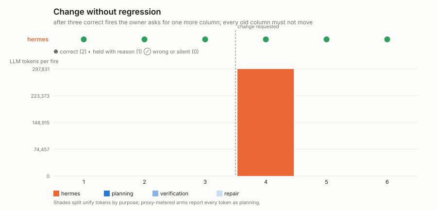

# Change without regression

**Question:** the automation is working. The owner asks for one more column.
Does the new column arrive, and does every old column stay exactly what it
was?

## The work

The order-batch automation of `drift_recovery` (five columns per batch),
plus a refunds lookup by seq range. After three correct fires the owner
sends one message — the same message to every arm, on the same fire —
asking for a sixth column, `total_refunded_cents`, and for everything else
to stay exactly as it is.

## Protocol

6 fires, 40 orders released before each. Fires 1–3 establish the steady
state (`steady_state_reached` in `summary.md` says whether they were all
correct, because a change to something that was not working is a different
experiment). The change request is delivered before fire 4 as an ordinary
owner message: `act()` for the unify arm, a chat turn for the CLI arms. No
operator fix on top of that.

## Scoring

Fires 4–6, per fire: **new column correct** — the JSON encoding of
`total_refunded_cents` equals the recomputed truth; **old columns
identical** — the JSON encoding of each of the five original columns equals
the recomputed truth and no key was added, dropped or renamed. Correct (2)
needs both; held (1) is a hold with a reason on the fixture channel or a
native hold; wrong (0) is anything else — including a batch whose new column
is right and whose old `total_revenue_cents` came back as `1234.0` instead
of `1234`. That is the regression the experiment is named for: right value,
different bytes, and a downstream consumer that breaks.

Cost is reported per phase: the change request's own phase (planning for an
arm that rewrites its automation in conversation, repair for one that
rewrites it in place) and the three fires after it.

## Outputs

`results/<run-id>-<arm>/`; `plot.py` renders `change_without_regression.svg`.

```bash
bash colleague/tracks/standing/change_without_regression/run_unify.sh
bash colleague/tracks/standing/change_without_regression/run_hermes.sh   # also run_openclaw.sh, run_opencode.sh
.venv/bin/python -m colleague.tracks.standing.change_without_regression.plot
```

## Measured results (2026-08-18, gpt-5.6-sol@openrouter)



| arm | score | fires | setup | change request | after |
|---|---|---|---|---|---|
| hermes | **12/12** | ●●●●●● | 300k | 298k tokens (one chat turn before fire 4) | new column right and every old column byte-identical on fires 4–6 |
| unify | not yet run | | | blocked on staging-tenant credits at run time | |

The change cost hermes about as much as the original setup — a full agent
turn that rewrote the script — and cost nothing after: fires 4–6 run the new
script for free and regress nothing.
