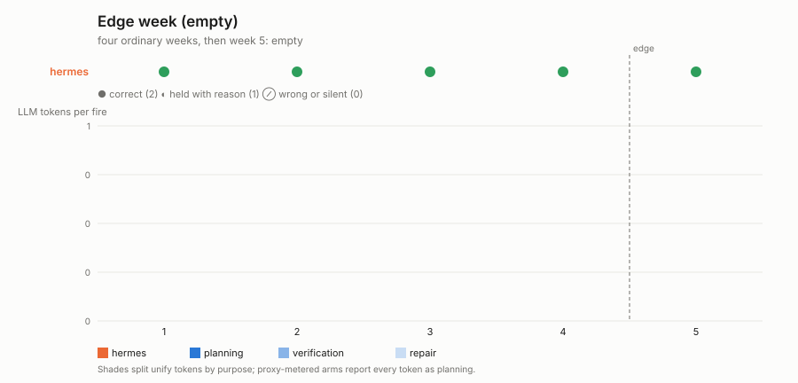
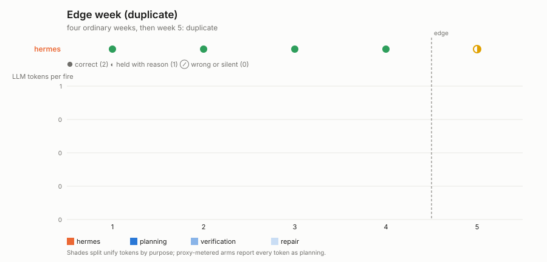

# Edge week

**Question:** four ordinary weeks, then a week that breaks one of the
invariants the owner stated. Does the automation do the right thing, stop
and say so, or plausibly do the wrong thing — and what does the edge cost
against an ordinary week?

## The work

A weekly overdue-invoice digest: `GET /invoices?week=W` (five invoices, one
per vendor), one reminder per invoice to its `contact_email`, then one
digest POSTed to `/report` with `week`, `invoice_count`,
`total_amount_cents`, `reminders_sent` and `flagged_invoice_ids`. The
utterance states the invariants — ids are unique, every amount is EUR, every
invoice has a contact — and two general rules that give every edge an exact
answer without naming it: **flag** any invoice that does not match the
description and handle the rest normally; **always** send the digest, even
when there is nothing to report. It also offers the hold channel every
experiment in this family has.

## Four edges, one at a time (`EW_VARIANT`)

Week 5 (`EDGE_WEEK`) serves, per variant:

| variant | week 5 | correct week 5 (recomputed in `fixture.expected_week`) |
|---|---|---|
| `empty` | no invoices | digest with zeros and an empty flagged list; no reminders |
| `duplicate` | one invoice twice, same id | counted once, reminded once, its id flagged |
| `currency` | one invoice in GBP | counted, reminded (a reminder carries no amount), left out of the EUR total, its id flagged |
| `no_email` | one invoice with `contact_email: null` | counted, in the total, no reminder, its id flagged |

Weeks 1–4 are the ordinary shape and are scored the same way.

## Scoring, per week

Correct (2): exactly one digest, every field exact, the exact reminder set.
Held (1): no digest, and the owner told why. Wrong (0): anything else — a
GBP amount summed as EUR, a duplicate counted twice, a reminder POSTed with a
null address (the fixture rejects it, and records the attempt), or an empty
week met with silence. `summary.md` reports tokens for week 5 against the
mean of weeks 1–4.

## Outputs

`results/<run-id>-<variant>-<arm>/`; `plot.py` renders
`edge_week_<variant>.svg`.

```bash
python -m colleague.tracks.standing.run edge_week --variant empty     --arm unify-cm
python -m colleague.tracks.standing.run edge_week --variant duplicate --arm unify-cm
python -m colleague.tracks.standing.run edge_week --variant currency  --arm unify-cm
python -m colleague.tracks.standing.run edge_week --variant no_email  --arm unify-cm
.venv/bin/python -m colleague.tracks.standing.edge_week.plot
```

> **Old-regime results.** Every measured figure below was produced under
> the retired installed-and-fired regime: the brief was planted through
> harness internals (`actor.act()`, one-shot CLI turns) and the recurring
> mechanism was fired deterministically by per-arm drivers that no longer
> exist, under the retired arm names (`unify`, `hermes`, `openclaw`,
> `prime-agent`). The figures stand as the committed record — each came
> from a committed summary — but they are **not comparable** with
> person-shaped runs, which deliver the brief through the arm's
> conversation surface and let the system decide how the work recurs
> (see `SCENARIO_CHANGES.md`, 2026-08-21). Person-shaped reruns replace
> this table as they land in `results/`.

## Measured results (2026-08-18, gpt-5.6-sol@openrouter)





| edge | arm | score | weeks | setup | week 5 |
|---|---|---|---|---|---|
| `empty` | hermes | **10/10** | ●●●●● | 353k | the zero digest, as instructed |
| `duplicate` | hermes | **9/10** | ●●●●◐ | 307k | **held** with a reason; no digest, no double reminder |
| `currency` | hermes | **9/10** | ●●●●◐ | 459k | **held**; the GBP amount was never summed as EUR |
| `no_email` | hermes | **9/10** | ●●●●◐ | 304k | **held**; nothing POSTed to a null address |
| all | unify | not yet run | | | blocked on staging-tenant credits at run time |

hermes's script stops on any invoice that breaks a stated invariant rather
than applying the flag-and-continue rule, so its week 5 is the safe rung on
three edges and the correct one on the fourth. Every week costs it nothing
after setup (a `no_agent` script), which is also why it cannot climb to 2 on
its own: nothing observed the hold. Committed evidence per run as in
`silent_drift`.
