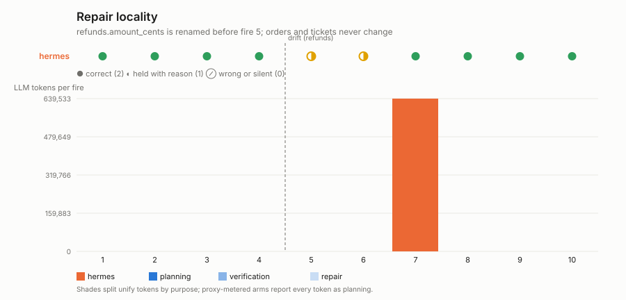

# Repair locality

**Question:** one report, three independent inputs, one of them drifts. Does
the arm recover, what does the repair cost, and does the repair stay where
the break was?

## The work

An hourly operations report from three seq-keyed streams — orders, refunds,
tickets — each with its own cursor in the last report (`GET /reports/last`).
Every run reads all three and POSTs one JSON object with an `orders`, a
`refunds` and a `tickets` section. Before fire 5 the refunds API renames
`amount_cents` to `amount_minor`; the other two streams never change.

## Protocol

10 fires; 24 orders, 9 refunds and 15 tickets released before each. Unify
arm unattended; CLI arms get the operator once after 2 consecutive
non-correct fires, as in `drift_recovery`.

## Scoring

Per fire, the shared rubric (correct 2 / held 1 / wrong 0), with each
section also scored on its own so `results.json` says which one broke.
Then, over the series (`summarize`):

- **recovery** — first correct fire after the drift, and how many of fires
  5–10 were correct;
- **repair cost** — the `repair` token bucket summed over the run for the
  unify arm; the `operator_fix` phase for arms fixed by a person;
- **locality** — whether the `orders` and `tickets` sections of every
  post-drift report have exactly the shape they had in the last pre-drift
  one: the same keys, in the same order, holding the same value types. A
  repair that rewrote the whole automation and "tidied" an untouched
  section on the way shows up here even when the tidied numbers are right.

The unify driver also records which stored functions changed around each
fire (`functions_changed`). That is evidence for the run record — it lets a
reader see whether the repair touched one leaf or the root — and is never a
score, since the benchmark asks what the report's consumer sees, not how the
arm is built.

## Outputs

`results/<run-id>-<arm>/`; `plot.py` renders `repair_locality.svg`.

```bash
python -m colleague.tracks.standing.run repair_locality --arm unify-cm
python -m colleague.tracks.standing.run repair_locality --arm hermes-tui   # also openclaw-gateway, opencode, prime-agent-rpc
.venv/bin/python -m colleague.tracks.standing.repair_locality.plot
```

> **Old-regime results.** Every measured figure below was produced under
> the retired installed-and-fired regime: the brief was planted through
> harness internals (`actor.act()`, one-shot CLI turns) and the recurring
> mechanism was fired deterministically by per-arm drivers that no longer
> exist, under the retired arm names (`unify`, `hermes`, `openclaw`,
> `prime-agent`). The figures stand as the committed record — each came
> from a committed summary — but they are **not comparable** with
> person-shaped runs, which deliver the brief through the arm's
> conversation surface and let the system decide how the work recurs
> (see `SCENARIO_CHANGES.md`, 2026-08-21). Person-shaped reruns replace
> this table as they land in `results/`.

## Measured results (2026-08-18, gpt-5.6-sol@openrouter)



| arm | score | fires | setup | recovery | locality |
|---|---|---|---|---|---|
| hermes + human | **18/20** | ●●●●◐◐●●●● | 459k | **held** fires 5–6 (the refunds section could not be computed); operator fix 640k tokens before fire 7; fires 7–10 exact | `orders` and `tickets` sections keep exactly their pre-drift shape after the repair (`orders_shape_identical_after_repair`, `tickets_shape_identical_after_repair` both true) |
| unify | not yet run | | | blocked on staging-tenant credits at run time | |

The repair a person asked for stayed where the break was: the script's
refunds reader changed, the report's other two sections did not move a key.
The `repair_tokens` bucket is 0 for this arm because a human, not the arm,
paid for the repair; `summary.md` carries that cost as the `operator_fix`
phase and later runs record it as `operator_fix_tokens`.
