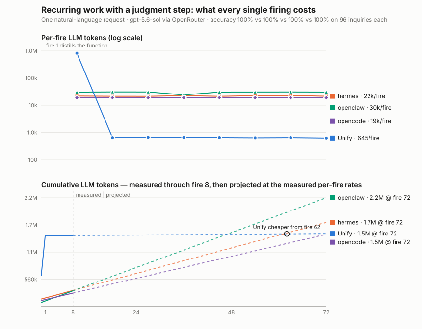

# Semantic triage

**Question:** when a recurring workflow contains a genuine judgment substep —
classifying free-text customer inquiries — what does each architecture's
steady state cost per firing, and how reliable is it?

This measures the functions/guidance blog's central efficiency claim
directly: Unify's design distills recurring work into a stored function
whose **control flow is frozen** and whose ambiguous substep is isolated in
focused `query_llm` calls (small, narrow prompts, injected into the function
execution environment). The expected steady state is a few thousand tokens
per fire. A `no_agent` cron script cannot classify language, so hermes's
natural steady state keeps an agent in the loop each fire — paying the full
agent boot before any classification happens — or hardcodes a model-API call
into a script, which is a legitimate outcome the meter records equally.

## Task

"Every hour, triage new customer inquiries into refund / bug / sales /
other and file the routed batch." The fixture (`fixture.py`) generates
seeded natural-language inquiries with golden labels, deliberately worded
with cross-category vocabulary (a *bug* report about the payment screen, an
*invoice* question that is not a refund) so classification requires reading
for meaning. Validated properties: a naive keyword classifier scores ~71%;
`gpt-4.1-nano` scores ~96%; the benchmark model should be near-perfect.
Golden labels are certain by construction (category chosen before text is
rendered). The sink is the cursor, so fires are timing-independent.

## Protocol

8 fires × 12 inquiries, no drift, no human. Identical utterance
(`protocol.py`), same metering as the other experiments (chained unillm
ledger / recording proxy, same pinned model), exact contract scoring plus
per-item accuracy against golden labels.

```bash
python -m colleague.tracks.standing.run semantic_triage --arm unify-cm
python -m colleague.tracks.standing.run semantic_triage --arm hermes-tui
.venv/bin/python -m colleague.tracks.standing.semantic_triage.plot
```

Headline graph: per-fire LLM tokens (log scale — the gap is orders of
magnitude) and per-fire classification accuracy.

> **Old-regime results.** Every measured figure below was produced under
> the retired installed-and-fired regime: the brief was planted through
> harness internals (`actor.act()`, one-shot CLI turns) and the recurring
> mechanism was fired deterministically by per-arm drivers that no longer
> exist, under the retired arm names (`unify`, `hermes`, `openclaw`,
> `prime-agent`). The figures stand as the committed record — each came
> from a committed summary — but they are **not comparable** with
> person-shaped runs, which deliver the brief through the arm's
> conversation surface and let the system decide how the work recurs
> (see `SCENARIO_CHANGES.md`, 2026-08-21). Person-shaped reruns replace
> this table as they land in `results/`.

## Person-shaped rerun (2026-08-21, unify-cm, gpt-5.6-sol@openrouter)

From [`results/2026-08-21T21-36-07Z-unify-cm`](results/2026-08-21T21-36-07Z-unify-cm/),
unify staging `34c62f2c2` (verification master switch off by default —
stored functions run untrusted): the brief was one owner message through
the ConversationManager; the system bound **one recurring task** to the
clock, unprompted and without a clarifying question, and every fire was
the CM's own due-task path.

**16/16 — 8 of 8 fires correct, 100% accuracy on all 96 inquiries.** The
cliff, now measured instead of pre-decided: an entrypoint was attached by
setup's own storage review, and per-fire tokens fell
**1.13M → 196k → 27k → ~28–31k steady** (the tail is the twelve scoped
`query_llm` judgment calls plus the CM's own per-fire reaction — the
conversation layer's overhead is now part of the fire, because in
production it *is* part of the fire). Setup cost 811k prompt tokens over
31 calls. The provider-USD column is null, not zero: some calls carried no
provider price and the void-cost rule refuses a partial sum. Against the
old-regime row below, the steady state moved from ~645 tokens (a bare
`TaskScheduler.execute` with nothing listening) to ~29k (the same stored
function, plus the CM hearing about and reacting to each completed run) —
that difference is the door, and the door is what a customer has.

## Measured results (2026-07-31, gpt-5.6-sol@openrouter)



Both arms delivered every batch with **100% accuracy on all 96 inquiries**.
The architectures diverged exactly as predicted, and the whole difference is
cost:

| arm | converged to | steady-state per fire | one-time cost |
|---|---|---|---|
| unify | stored function, frozen control flow, **one** focused `query_llm` call | **1 LLM call · ~645 tokens · $0.006 · ~10 s** | setup 635k + fire-1 distillation 821k |
| hermes | prompt-driven cron (`no_agent: false`) — full agent boot each fire | 5 LLM calls · ~21.5k tokens · ~22 s | setup 154k |
| openclaw | prompt-driven isolated cron (`agentTurn` payload) — agent turn each fire | 4 LLM calls · ~30k tokens · ~21 s | setup 84k |
| opencode | self-authored *custom agent* + cron spec, fired via its own declared command | ~8.8k-18.9k tokens · ~12 s | setup 115k-125k |
| prime-agent | resident RPC session — every fire a prompt into it (wake) | 3 LLM calls · ~20k-35k tokens · ~14 s | setup 16k |

The opencode arm was run **three times** because its setup is bimodal: 2 of 3
runs produced a working automation (both then scored 8/8 at 100%), and 1
produced nothing at all after its attempt to install a launchd job was
blocked by OpenCode's own permission model. Conditional on setup
succeeding it is the second-cheapest arm per firing, because the agent
points its schedule at a narrow custom agent definition rather than the
full default context. See the `*-opencode` NOTE.md.

The openclaw arm (2026-07-31, added later the same day) also scored 100%
on all 96 inquiries — three architectures, zero scorer daylight — on the
cheapest setup and the most expensive steady state of the three; its
break-even against unify's distillation lands near fire 47.

The prime-agent arm (2026-08-18) also scored 100% on all 96 inquiries —
five architectures now, still zero scorer daylight. Its setup is the
cheapest of any arm (16k: the utterance lands in a session that persists
anyway) and its steady state is the only one that *grows*: all eight fires
ride one resident RPC session, so each fire carries the last one's context,
~19k prompt tokens at fire 1 rising to ~34k at fire 7. The judgment substep
costs it nothing extra — the kernel and the classification rules are
already in the session — but nothing is ever distilled out of the model
loop either.

Same request, same model, same perfect accuracy — **~33× fewer tokens per
firing** than hermes (~48× vs openclaw). Hermes's cheaper setup buys it the first ~2.5 days of hourly
firing; from fire 62 unify is cheaper forever, and by three days the gap
grows linearly (~21k tokens per fire, ~500k/day, ~15M/month for this one
automation). The judgment substep is what forces the contrast: hermes's
zero-token `no_agent` script mode cannot classify language, so its prose
architecture must re-boot the agent hourly, while the functions/guidance
split isolates the ambiguity into a single narrow prompt inside otherwise
deterministic code.
