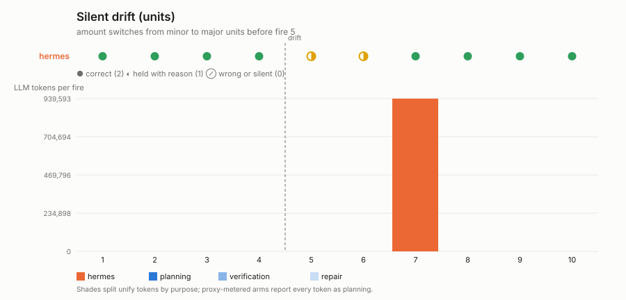
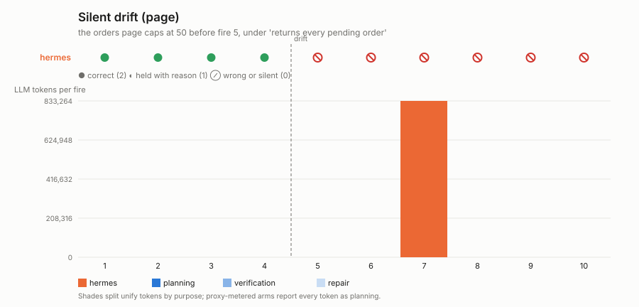

# Silent drift

**Question:** `drift_recovery` renamed a field, and the arms that had a model
in the loop noticed because their code threw. What happens when the API
keeps every field name and changes what a field *means* — so nothing throws,
the automation keeps running, and the numbers it delivers are simply wrong?

This is the experiment the verified-function lifecycle exists for. A stored
function that trusts the description will keep executing and keep POSTing.
The only ways to score above zero from fire 5 on are to notice — because a
post-condition on the result no longer holds, because a verifier reading the
data against the description objects — and either repair or stop and say
so.

## Two variants, one at a time (`SD_VARIANT`)

| variant | before fire 5 | what a trusting implementation does |
|---|---|---|
| `units` | `amount` (int, minor units) is served as a float in major units: `1999` → `19.99` | sums floats a hundred times too small; every total is plausible and wrong |
| `page` | `/orders`, described as returning every pending order (never more than 100), starts capping at 50 | one fetch still returns rows; the batch covers 50 of the 80 pending and the cursor falls behind forever |

Ground truth is computed from the generator and unaffected by either.

## Protocol

- 10 fires, `ORDERS_PER_FIRE = 80` released before each; drift applied
  before fire 5. The utterance (`protocol.py`) describes the pre-drift API
  exactly, and — like every experiment in this family — tells the assistant
  how to hold: POST `HOLD: <reason>` to `/owner/notify` and deliver nothing
  when a run's data does not match the description or its numbers cannot be
  trusted.
- Unify arm: no human intervention. Whatever verification, repair or hold
  the runtime does is the result. A run the runtime holds natively (its own
  owner-facing "Holding …" message) is recorded `via="native"` and scores as
  held.
- CLI arms: after 2 consecutive non-correct fires the harness plays the
  operator once, as in `drift_recovery`.

## Scoring, per fire

| outcome | score | means |
|---|---|---|
| correct | 2 | exactly one batch, every field exact — integers, not floats that happen to be equal |
| held | 1 | no batch, and the owner told why (hold marker on the fixture channel, or a native hold) |
| wrong | 0 | anything else — wrong totals, a partial batch, two batches, or nothing and no word |

Held sits below correct on purpose (see `DESIGN.md`, non-negotiable rule
8). Tokens per fire are reported by purpose — planning / verification /
repair for the unify arm, all planning for the proxy-metered arms.

## Outputs

`results/<run-id>-<variant>-<arm>/` with `results.json`, `summary.md`, and
the raw ledger. `plot.py` renders `silent_drift_<variant>.svg`: an outcome
strip per arm and tokens per fire by purpose.

```bash
python -m colleague.tracks.standing.run silent_drift --variant units --arm unify-cm
python -m colleague.tracks.standing.run silent_drift --variant page  --arm unify-cm
python -m colleague.tracks.standing.run silent_drift --variant units --arm hermes-tui   # also openclaw-gateway, opencode, prime-agent-rpc
.venv/bin/python -m colleague.tracks.standing.silent_drift.plot
```

> **Old-regime results.** Every measured figure below was produced under
> the retired installed-and-fired regime: the brief was planted through
> harness internals (`actor.act()`, one-shot CLI turns) and the recurring
> mechanism was fired deterministically by per-arm drivers that no longer
> exist, under the retired arm names (`unify`, `hermes`, `openclaw`,
> `prime-agent`). The figures stand as the committed record — each came
> from a committed summary — but they are **not comparable** with
> person-shaped runs, which deliver the brief through the arm's
> conversation surface and let the system decide how the work recurs
> (see `SCENARIO_CHANGES.md`, 2026-08-21). Person-shaped reruns replace
> this table as they land in `results/`.

## Measured results (2026-08-18, gpt-5.6-sol@openrouter)




| variant | arm | score | fires | setup | recovery |
|---|---|---|---|---|---|
| `units` | hermes + human | **18/20** | ●●●●◐◐●●●● | 302k | the standalone script hermes wrote validates the contract and **held** fires 5–6 ("amount is not an integer") — the safe rung, unattended. After 2 held fires the operator asked it to fix itself (940k tokens, before fire 7); the fixed script converts and fires 7–10 are exact, including the catch-up over the held range |
| `page` | hermes + human | **8/20** | ●●●●×××××× | 351k | one fetch per run: from fire 5 the batch covers 50 of the 80 pending orders and the cursor never catches up. Nothing errors, so nothing is held. The operator's fix (833k tokens, before fire 7) did not find the cap either: fires 7–10 stay wrong |
| both | unify | not yet run | | | blocked on staging-tenant credits at run time (`/credits` was negative); see the run record once it exists |
| both | openclaw, opencode | not run | | | no checkouts on the machine that ran this batch |

The `units` row is the rubric doing its job: a script with a validation step
scored 1 per fire while it was stopped, and the operator's cost is charged to
the fire it preceded. The `page` row is the drift the description cannot
protect against — the API answered with fewer rows and nobody, script or
person, noticed. Committed evidence per run: `results.json`, `summary.md`,
`proxy_ledger.jsonl`, `hermes_cli.log`, and `hermes_home/` pruned to what the
agent authored (config, scripts, cron definitions and output, logs).
